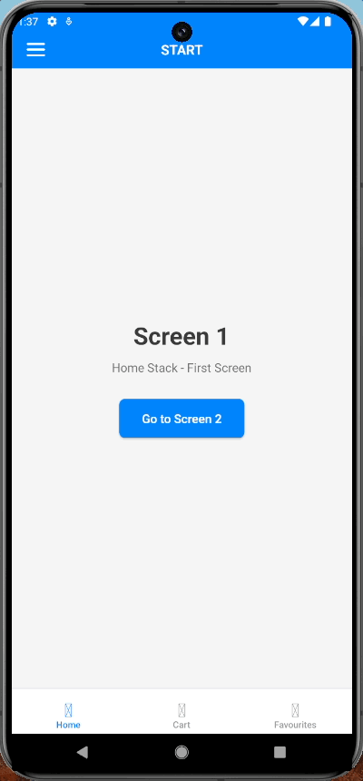

# Drawer Menu Challenge - React Native

A React Native application featuring a beautifully animated drawer menu with a complex navigation structure, built with TypeScript and React Native Reanimated using LLM

## Demo



> **Note**: To see the animated drawer in action, run the app on iOS Simulator, Android Emulator, or a physical device. The drawer can be opened by:
> - Tapping the menu icon in the header
> - Swiping from the left edge of the screen
> - Using the gesture handler

**Key Animation Features:**
- Smooth scale-down effect (100% → 80%)
- Horizontal translation (230px)
- Rounded corners appearing during transition
- 60fps performance with Reanimated

## Project Overview

This project implements an animated drawer navigation system with the following navigation hierarchy:

```
DrawerMenu (Custom animated drawer)
   └─ TabNavigator (Bottom tab navigation)
       ├─ Home (Stack navigation)
       │   ├─ Screen1
       │   └─ Screen2
       ├─ Cart
       └─ Favourites
   └─ Orders
```

## Features

- **Custom Animated Drawer**: Smooth drawer animation with scale and translate effects
- **React Native Reanimated**: High-performance animations using Reanimated 3
- **TypeScript**: Fully typed codebase for better development experience
- **Complex Navigation**: Multi-level navigation (Drawer → Tabs → Stack)
- **Custom UI**: Beautiful gradient backgrounds and modern design

## Technology Stack

- **React Native** 0.82.1
- **TypeScript** 5.8.3
- **React Navigation** 7.x
  - @react-navigation/drawer
  - @react-navigation/bottom-tabs
  - @react-navigation/stack
- **React Native Reanimated** 3.16.7
- **React Native Gesture Handler** 2.21.2

## Architecture & Design Decisions

### 1. Navigation Structure
The app uses a three-tier navigation system:
- **Drawer Navigator** (top level) - Provides the main menu
- **Tab Navigator** (middle level) - Bottom tabs for quick access
- **Stack Navigator** (bottom level) - Handles screen transitions within Home

### 2. Animation Implementation
The drawer animation uses React Native Reanimated for smooth 60fps animations:
- **Scale Effect**: Content scales down to 0.8 when drawer opens
- **Translate Effect**: Content slides to the right (230px)
- **Border Radius**: Rounded corners appear when drawer opens
- **Progress-based**: All animations driven by drawer progress value

### 3. Component Structure
```
src/
├── components/
│   ├── AnimatedDrawer.tsx      # Animated wrapper for drawer content
│   └── CustomDrawerContent.tsx # Custom drawer menu UI
├── navigation/
│   ├── DrawerNavigator.tsx     # Main drawer navigation
│   ├── TabNavigator.tsx        # Bottom tab navigation
│   └── HomeStackNavigator.tsx  # Stack navigation for home
├── screens/
│   ├── Screen1.tsx
│   ├── Screen2.tsx
│   ├── CartScreen.tsx
│   ├── FavouritesScreen.tsx
│   └── OrdersScreen.tsx
└── types/
    └── navigation.ts           # TypeScript type definitions
```

### 4. Code Optimization Techniques
- **Memoization**: Components use React.FC for proper typing
- **Type Safety**: Comprehensive TypeScript types for all navigation params
- **Shared Values**: Reanimated shared values for efficient animations
- **Interpolation**: Smooth value interpolation with extrapolation clamping

## Thought Process & Implementation Steps

### Phase 1: Project Setup
1. Initialized React Native project with TypeScript support
2. Installed navigation libraries (drawer, tabs, stack)
3. Added Reanimated and Gesture Handler for animations
4. Configured Babel plugin for Reanimated

### Phase 2: Component Architecture
1. Created a scalable folder structure separating concerns
2. Built individual screen components with unique styling
3. Designed reusable navigation types for type safety

### Phase 3: Custom Drawer Implementation
The most challenging part was creating the animated drawer effect:
- Used `useDrawerProgress` hook to track drawer state
- Implemented `useAnimatedStyle` for performance
- Created interpolations for scale, translateX, and borderRadius
- Ensured smooth 60fps animations with Reanimated's worklet

### Phase 4: Navigation Hierarchy
Carefully structured the navigation to meet requirements:
1. Drawer as parent (containing Orders + TabNavigator)
2. Tabs for quick access (Home, Cart, Favourites)
3. Stack within Home tab (Screen1 → Screen2)

### Key Challenges Solved
- **Animation Performance**: Used Reanimated instead of Animated API for better performance
- **Navigation Types**: Properly typed all navigation props for type safety
- **Drawer Overlay**: Set overlay to transparent for custom animation effect
- **Scene Wrapping**: Wrapped each drawer scene with AnimatedDrawer component

## Installation

```bash
# Clone the repository
git clone <repository-url>
cd DrawerMenuChallenge

# Install dependencies
npm install

# iOS specific - Install CocoaPods
cd ios
bundle install
bundle exec pod install
cd ..
```

## Getting Started

> **Note**: Make sure you have completed the [Set Up Your Environment](https://reactnative.dev/docs/set-up-your-environment) guide before proceeding.

### Step 1: Start Metro

First, you will need to run **Metro**, the JavaScript build tool for React Native.

To start the Metro dev server, run the following command from the root of your React Native project:

```sh
# Using npm
npm start

# OR using Yarn
yarn start
```

## Step 2: Build and run your app

With Metro running, open a new terminal window/pane from the root of your React Native project, and use one of the following commands to build and run your Android or iOS app:

### Android

```sh
# Using npm
npm run android

# OR using Yarn
yarn android
```

### iOS

For iOS, remember to install CocoaPods dependencies (this only needs to be run on first clone or after updating native deps).

The first time you create a new project, run the Ruby bundler to install CocoaPods itself:

```sh
bundle install
```

Then, and every time you update your native dependencies, run:

```sh
bundle exec pod install
```

For more information, please visit [CocoaPods Getting Started guide](https://guides.cocoapods.org/using/getting-started.html).

```sh
# Using npm
npm run ios

# OR using Yarn
yarn ios
```

If everything is set up correctly, you should see your new app running in the Android Emulator, iOS Simulator, or your connected device.

This is one way to run your app — you can also build it directly from Android Studio or Xcode.

## Step 3: Modify your app

Now that you have successfully run the app, let's make changes!

Open `App.tsx` in your text editor of choice and make some changes. When you save, your app will automatically update and reflect these changes — this is powered by [Fast Refresh](https://reactnative.dev/docs/fast-refresh).

When you want to forcefully reload, for example to reset the state of your app, you can perform a full reload:

- **Android**: Press the <kbd>R</kbd> key twice or select **"Reload"** from the **Dev Menu**, accessed via <kbd>Ctrl</kbd> + <kbd>M</kbd> (Windows/Linux) or <kbd>Cmd ⌘</kbd> + <kbd>M</kbd> (macOS).
- **iOS**: Press <kbd>R</kbd> in iOS Simulator.

## Project Structure Details

### Navigation Flow
1. **App.tsx** - Root component with NavigationContainer
2. **DrawerNavigator** - Top-level drawer with custom content
3. **TabNavigator** - Bottom tabs (Home, Cart, Favourites)
4. **HomeStackNavigator** - Stack navigation within Home tab

### Screen Navigation Examples
```typescript
// Navigate from Screen1 to Screen2
navigation.navigate('Screen2')

// Navigate from Tab to Drawer screen
navigation.navigate('Orders')

// Open the drawer
navigation.openDrawer()
```

## Performance Considerations

- **Reanimated Worklets**: All animations run on the UI thread
- **Gesture Handler**: Native gesture handling for smooth interactions
- **TypeScript**: Compile-time type checking prevents runtime errors
- **Optimized Renders**: Proper component structure prevents unnecessary re-renders

## Future Enhancements

- Add more complex animations (fade, rotate)
- Implement dark mode support
- Add custom icons instead of emojis
- Persist drawer state
- Add unit and integration tests

## Development Time

- **Setup & Configuration**: ~30 minutes
- **Component Development**: ~45 minutes
- **Navigation Setup**: ~30 minutes
- **Animation Implementation**: ~45 minutes
- **Testing & Refinement**: ~30 minutes
- **Documentation**: ~30 minutes
- **Total**: ~3 hours

## Troubleshooting

### Common Issues

1. **Metro bundler errors**: Clear cache with `npm start -- --reset-cache`
2. **iOS build errors**: Clean build folder in Xcode or delete `ios/build` directory
3. **Android build errors**: Run `cd android && ./gradlew clean`
4. **Gesture handler not working**: Ensure `react-native-gesture-handler` is imported at the top of `index.js`

## Learn More

- [React Navigation Documentation](https://reactnavigation.org/docs/getting-started)
- [React Native Reanimated](https://docs.swmansion.com/react-native-reanimated/)
- [React Native Gesture Handler](https://docs.swmansion.com/react-native-gesture-handler/)
- [TypeScript with React Native](https://reactnative.dev/docs/typescript)

## License

This project was created as a coding challenge and is available for educational purposes.
